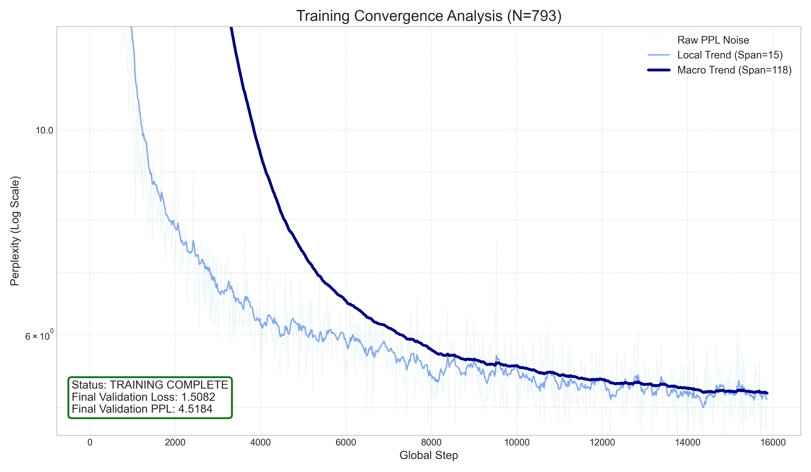
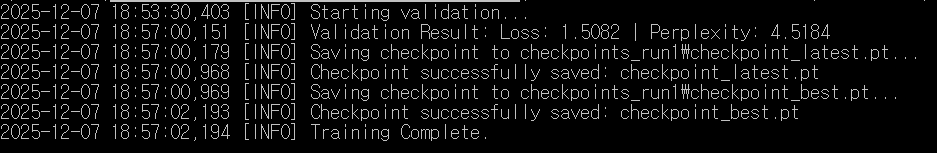
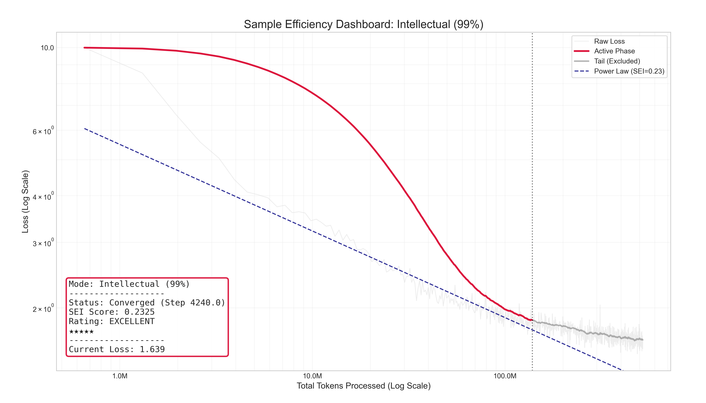
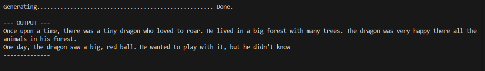
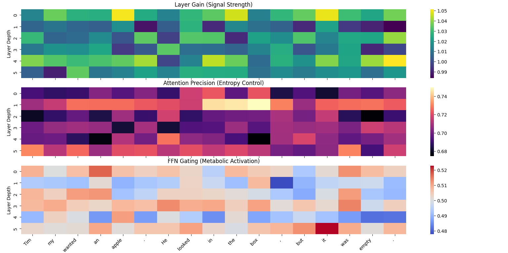

# Neuromodulatory Control Networks (NCNs)

Large Language Models (LLMs) based on the Transformer architecture have achieved remarkable success, yet their core processing mechanisms remain largely static after training. While powerful, this static nature limits their ability to dynamically adapt their processing strategy based on nuanced contextual cues, task demands, or desired operational modes (e.g., shifting between exploration and exploitation). 

We propose **Neuromodulatory Control Networks (NCNs)**, a novel architectural modification inspired by the neuromodulatory systems in the vertebrate brain (e.g., those utilizing dopamine, acetylcholine, norepinephrine). NCNs are small, parallel networks that receive contextual input—summarizing the global state, task information, or external control signals—and compute dynamic "modulatory signals." These signals are distributed as layer-specific control vectors to the main LLM to influence its computational properties during a forward pass, analogous to how neuromodulators alter neuronal gain, plasticity, and network states across different cortical depths. 

Instead of merely routing information, NCNs aim to change *how* information is processed throughout the base model by modulating key components like attention mechanisms (e.g., via precision scaling), layer gains, and activation functions. Crucially, the architecture allows the model to *implicitly learn* to self-regulate these parameters via backpropagation, effectively becoming its own "tuning expert." We further introduce formal stability mechanisms, including homeostatic regularization, to prevent control manifold collapse.

## Architecture and Mechanism

The Neuromodulatory Control Network architecture operates by running a compact neural network in parallel with the main LLM. When the system processes an input sequence, the NCN generates a latent representation (a sequence of $d$-dimensional vectors) that captures the specific "texture" or entropy of the input. During training, the network uses end-to-end gradient modulation to dynamically adjust:

1.  **Attention Precision ($\beta$):** Acting as an inverse temperature control to sharpen or broaden focus.
2.  **Layer Gain ($g$):** Controlling signal propagation strength.
3.  **Feed-Forward Gating ($\gamma$):** Modulating the metabolic activity of reasoning layers.

We recently updated the architecture to utilize **Phasic** rather than Tonic representations. While a tonic representation might generate identical embeddings for "The dog chased the cat" and "The cat chased the dog" (bag-of-words approach), the phasic approach distinguishes the specific causal structure of the sequence. This prevents the system from overfitting on keywords, ensuring that the NCN can distinguish between rote calculation contexts (triggering low temperature) and complex creative tasks (triggering high temperature) even when they share vocabulary.

## Empirical Results: Micro-Scale Validation

To validate the architecture, we trained an **18M parameter NCN model** for a single epoch on the **TinyStories** dataset. 

*   **Baseline Expectation:** Standard Transformers in this parameter class typically struggle to break **5.5 - 6.0** perplexity (PPL) in a single epoch.
*   **NCN Result:** The NCN model completed the run with a **Validation Loss of 1.5082** and a **Perplexity of 4.5184**.

### Training Stability and Convergence
The training run demonstrated high stability with zero gradient explosions, validated by the flat Homeostatic Regularization term ($\mathcal{L}_{reg} \approx 0.0033$) throughout the latter half of training.

*(Fig 1. Perplexity reduction over time. The model reached fluent English capabilities (<10 PPL) within the first 15% of training.)*

### Sample Efficiency Analysis (SEI)
A primary advantage of NCNs is **Sample Efficiency**—the ability to learn more generalizable patterns from fewer tokens. We utilized a Sample Efficiency Index (SEI) dashboard to visualize convergence speed.

**1. Grammar and Syntax (95% Convergence)**
The model converged on grammatical structure very early in the training run. The Power Law fit (dashed blue line) indicates a steep learning curve, suggesting the modulation allowed the model to find optimal gradients for syntax faster than a static network.

**2. Intellectual Consolidation (99% Convergence)**
Even for "intellectual" convergence (logic, object permanence, narrative consistency), the model showed high sample efficiency. The "Active Phase" (Red line) hugs the optimal Power Law curve tightly, indicating sustained learning without the plateaus often seen in small models.

---

### Qualitative Results: Coherence and Object Permanence

To assess performance qualitatively, we evaluated text generation. Standard Transformer models in the 18M parameter class often suffer from severe "context drift" (forgetting the subject) and hallucination.

**Input Prompt:** *Once upon a time, there was a tiny dragon who loved to*

> **Model Output:** "...roar. He lived in a big forest with many trees. The dragon was very happy there all the animals in his forest. One day, the dragon saw a big, red ball. He wanted to play with it, but he didn't know..."

**Analysis:**
*   **Subject Retention:** The model consistently tracks the protagonist ("tiny dragon" $\rightarrow$ "He" $\rightarrow$ "The dragon").
*   **Semantic Consistency:** The setting remains logical ("forest" $\rightarrow$ "trees" $\rightarrow$ "animals").
*   **Causal Logic:** The narrative follows a logical chain: Introduction $\rightarrow$ State Description $\rightarrow$ Inciting Incident.

---

### Mechanistic Interpretability: "Brain Scans"

To prove that the NCN is actively modulating the network rather than learning a static bias, we performed a trace analysis during inference. The model was fed a high-entropy sequence containing a narrative "plot twist":

> *"Timmy wanted an apple. He looked in the box, **but** it was **empty**."*

The heatmaps below visualize the internal signals generated by the NCN for every layer at every token step.

*(Fig 4. Mechanistic Trace of NCN Signals. X-axis: Token sequence. Y-axis: Layer depth 0-5.)*

#### Observation A: Spontaneous Functional Specialization
The NCN learned to assign distinct roles to different layers without explicit supervision (See *Attention Precision* heatmap):
*   **Layer 1 (The "Focuser"):** High precision (Yellow), acting as a precise feature extractor.
*   **Layer 2 (The "Scanner"):** Low precision (Dark Purple), acting as a broad context mixer.
This mimics biological **laminar specialization**, where cortical layers have distinct connectivity profiles for feed-forward vs. feedback processing.

#### Observation B: Phasic Reactivity
The NCN demonstrates event-driven modulation. When the model encounters the token **"but"** (signaling a contradiction), we observe a vertical color shift in the heatmaps. The NCN instantaneously alters the precision of deeper layers (Layers 4 & 5) to handle the conflict between expectation (apple) and reality (empty).

#### Observation C: Metabolic Gating
The **FFN Gating** heatmap (Bottom) shows selective dampening (Blue regions) for specific tokens. This acts as a dynamic, learned "Dropout," effectively saving computational capacity on "easy" tokens and allocating full network depth only where necessary.

## Future Work

While the initial 18M parameter experiment provides compelling evidence for the efficacy of Neuromodulatory Control Networks, several avenues of research remain to fully characterize the architecture's potential.

### Comparative Benchmarking (Iso-Parameter Control)
The immediate next step is to conduct a rigorous A/B test against a standard Transformer baseline. To ensure scientific validity, the control model will be trained with:
*   Identical parameter count ($N \approx 18M$).
*   Identical training data order (Fixed Seed).
*   Identical token budget (1 Epoch of TinyStories).
*   **Metric:** We aim to quantify the specific perplexity delta ($\Delta PPL$) attributable solely to the NCN mechanism.

### Scaling Law Analysis
We intend to investigate how the benefits of NCNs scale with model size. Specifically, does the "sample efficiency gap" observed at the micro-scale (18M) widen or narrow as the model scales to 100M, 350M, and 1B parameters?

### Dynamic Sparsity and Conditional Compute
The current implementation computes all layers and modulates their output. However, the **FFN Gating** signals ($\gamma$) often approach zero for specific tokens. Future iterations could leverage this for true conditional computation (skipping blocks entirely) to reduce inference FLOPs.
